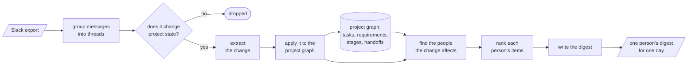

# Daily Digest

This is a prototype of one question: which state changes in a hardware team's Slack
should reach which person each day, and why. A small core over SQLite turns a Slack
export plus a seeded project graph into per-person digests, running fully offline in
replay mode (gold labels stand in for model calls), and five attachments each add
one opinionated capability behind a flag.
This file covers running it, the measured results, and the limits — rationale for
decisions made along the way is in [DESIGN.md](DESIGN.md) and
[EXPERIMENTS.md](EXPERIMENTS.md).

## How it works



The left half is `digest ingest`; the right half is `digest run` for one person and
date. The project graph is written by apply and read by fan-out — that is how a
change in one team's thread reaches an owner who never saw the thread. Each
attachment swaps exactly one step behind a flag: A1 the yes/no decision, A2 and A3
the ranking, A4 name resolution inside apply, A5 the rendering. Remove any of them
and the core path is untouched.

## Quickstart

```
uv run digest demo
```

From a fresh clone, with no API keys, this prints a guided walkthrough:

- a planted cross-team thread, and the digests of the two affected owners who
  never appear in that thread;
- one user's stage-aware (`--phase`) digests on day 5 and day 7, either side of a
  phase gate — plus the same day ranked with and without `--phase`, and a live
  count of how many digests `--phase` reorders;
- an `explain` trace from one digest item back to the decider call that let its
  thread through;
- the results table.

It runs on an in-memory database and writes nothing. `uv run digest --help` lists
the other commands (`ingest`, `run`, `explain`, `eval`); `uv run pytest` runs the
tests.

## Results

Condensed from [results.md](results.md), written by `digest eval` against
`data/gold.json` (live jev and OpenAI calls on Oct 5; the full file has every
metric, definitions, and reliability plots under `calibration/`). Values are
hits/total; `–` means the metric does not apply to that configuration. The two
headline metrics: **silo recall** is the share of planted cross-team changes that
reach the affected person's digest, and **digest precision** is the share of
digest items that match a gold label for that person.

| Configuration | Silo recall | Digest precision | Extractor accuracy | Gate accuracy | Escalation rate | Median decide | Cost per digest |
| --- | --- | --- | --- | --- | --- | --- | --- |
| core | 12/12 | 43/43 | 120/120 | – | – | – | – |
| llm | 12/12 | 39/41 | 114/120 | – | – | – | – |
| a1-passthrough | 12/12 | 43/43 | 120/120 | 35/120 | 0/120 | 0 ms | $0.0000 |
| a1-jev | 11/12 | 31/31 | 110/120 | 106/120 | 30/120 | 174 ms | $0.0002 |
| a1-llm | 12/12 | 38/38 | 116/120 | 114/120 | 3/120 | 3070 ms | $0.0149 |
| a1-jev-llm | 11/12 | 29/29 | 108/120 | 108/120 | 29/120 | 184 ms | $0.0055 |
| a2-calibrated | 12/12 | 43/43 | 120/120 | – | – | – | – |
| a3-phase | 12/12 | 43/43 | 120/120 | – | – | – | – |
| a4-aliases | 12/12 | 41/43 | 115/120 | – | – | – | – |

All 12 planted cross-team changes reach the affected person in every core-path
configuration, and recall holds through a live extractor: the `llm` row is 12/12
at 39/41 precision. The jev gate is ~18× faster and ~70× cheaper per digest than
the LLM decider (billed prices on both sides), at the cost of one missed case and
a 30/120 unsure band; the two-stage jev→llm cascade resolves that band at a third
of the LLM decider's cost. The whole evaluation cost about $6.44 in model spend.

## Enabling the attachments

Each attachment encodes one opinion behind one core seam (A1 the decider, A2 and
A3 the ranker, A4 `apply`, A5 the renderer); these are the switches. Replay ingest
(`digest ingest data/slack.json --replay`) needs no keys; the live extractor drops
`--replay` and needs `DIGEST_EXTRACTOR_MODEL` and `OPENAI_API_KEY`.

| # | Attachment | Enable with | Needs |
| --- | --- | --- | --- |
| A1 | Classifier cascade | `digest ingest … --decider jev\|llm`, optionally `--escalate-to llm` for the two-stage cascade | `JEV_API_KEY` for jev; `DIGEST_DECIDER_MODEL` + `OPENAI_API_KEY` for llm |
| A2 | Calibrated thresholds | `digest run … --ranker calibrated` | nothing |
| A3 | Stage-aware focus | `digest run … --phase` | `data/phase_weights.yaml` (in the repo) |
| A4 | Entity aliases | `digest ingest … --aliases` | alias rows in `data/graph_seed.json`; only does real work under the live extractor, since replay already emits canonical IDs |
| A5 | Phrased digest | `digest run … --render llm` | `DIGEST_RENDERER_MODEL` + `OPENAI_API_KEY`; falls back to the template on any failure |

`digest eval` runs every configuration above against the gold labels and rewrites
`results.md`; configurations whose keys are missing are reported as "not run"
rather than failing the eval.

## Scope and limits

- The dataset is synthetic: ~120 threads over ten working days, model-generated
  from a scenario and hand-edited. Counts sit beside percentages, and single-count
  gaps are treated as noise.
- Gold's affected lists come from the fan-out rules themselves, so the core row
  proves the pipeline; the live `llm` row is the real test of the idea (12/12 at
  39/41).
- A3's measurable effect here is ordering: no inbox holds more than three items,
  so membership metrics can't move, and `--phase` reorders 2 of 33 digests. The
  demo shows one day under both rankers; the gate flip is pinned in
  `tests/test_phase.py`. Deeper live inboxes are where it would pay off.
- Dollar figures are derived from billed spend on both backends (EXPERIMENTS.md
  has the derivations).
- Temperature scaling helped only the uncalibrated baseline; jev and the LLM
  decider were already close to calibrated.
- The digest covers task and requirement changes on an existing project graph.
  The risk question is asked but unscored, and nothing yet learns from use —
  per-user feedback thresholds are the natural next attachment.
