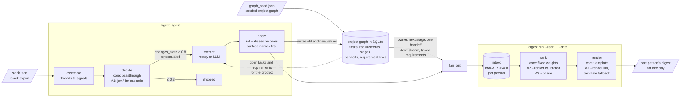

# Daily Digest

This is a prototype of one question: which state changes in a hardware team's Slack
should reach which person each day, and why. A small core over SQLite turns a Slack
export plus a seeded project graph into per-person digests, running fully offline in
replay mode, and five attachments each add one opinionated capability behind a flag.
This file covers running it, the measured results, and the limits — rationale for
decisions made along the way is in [DESIGN.md](DESIGN.md) and
[EXPERIMENTS.md](EXPERIMENTS.md).

## The system



`apply` writes the project graph and `fan_out` reads it, which is how a change in one
team's thread reaches an owner who never saw the thread. Each attachment replaces or
wraps exactly one box behind a flag (A1 the decider, A2/A3 the ranker, A4 `apply`,
A5 the renderer) and removing it leaves the core path untouched.

## Quickstart

```
uv run digest demo
```

From a fresh clone, with no API keys, this prints a guided walkthrough: one planted
cross-team thread, the digests of the two affected owners who never appear in that
thread, the `--phase` section (one user's digests on day 5 and day 7 either side of
the EVT gate, the live count of digests `--phase` reorders, and one day rendered by
the core ranker and by `--phase` side by side), an `explain` trace from digest item
back to decider routing, and the results table.
It runs on an in-memory database and writes nothing. `uv run digest --help` lists
the other commands (`ingest`, `run`, `explain`, `eval`); `uv run pytest` runs the
tests.

## Results

Condensed from [results.md](results.md), written by `digest eval` against
`data/gold.json` (live jev and OpenAI calls on Oct 5; the full file has every
metric, definitions, and reliability plots under `calibration/`). Values are
hits/total; `–` means the metric does not apply to that configuration.

| Configuration | Silo recall | Digest precision | Extractor accuracy | Gate accuracy | Escalation rate | Median decide | Cost per digest |
| --- | --- | --- | --- | --- | --- | --- | --- |
| core | 12/12 | 43/43 | 120/120 | – | – | – | – |
| llm | 12/12 | 39/41 | 114/120 | – | – | – | – |
| a1-passthrough | 12/12 | 43/43 | 120/120 | 35/120 | 0/120 | 0 ms | $0.0000 |
| a1-jev | 11/12 | 31/31 | 110/120 | 106/120 | 30/120 | 174 ms | $0.0002 |
| a1-llm | 12/12 | 38/38 | 116/120 | 114/120 | 3/120 | 3070 ms | $0.0149 |
| a1-jev-llm | 11/12 | 29/29 | 108/120 | 108/120 | 29/120 | 184 ms | $0.0055 |
| a2-calibrated | 12/12 | 43/43 | 120/120 | – | – | – | – |
| a3-phase | 12/12 | 43/43 | 120/120 | – | – | – | – |
| a4-aliases | 12/12 | 41/43 | 115/120 | – | – | – | – |

What the table supports: all 12 planted cross-team changes reach the affected
person in every core-path configuration. The core row at full marks validates the
deterministic pipeline end to end, and the `llm` row carries the claim through a
live extractor — 12/12 silo recall at 39/41 digest precision. The jev cascade
gates threads roughly 18× faster and, at billed prices on both backends, about
70× cheaper per digest than the LLM decider ($0.0002 against $0.0149), at the
cost of one missed silo case and a 30/120 escalation band; the two-stage jev→llm
cascade keeps jev's speed and resolves the band at roughly a third of the LLM
decider's cost. The entire three-round evaluation program cost about $6.44 in
model spend.

## Enabling the attachments

Each attachment encodes one opinion behind one core seam (A1 the decider, A2/A3
the ranker, A4 `apply`, A5 the renderer); these are the switches. Replay ingest (`digest ingest data/slack.json --replay`) needs no keys;
the live extractor drops `--replay` and needs `DIGEST_EXTRACTOR_MODEL` and
`OPENAI_API_KEY`.

| # | Attachment | Enable with | Needs |
| --- | --- | --- | --- |
| A1 | Classifier cascade | `digest ingest … --decider jev\|llm`, optionally `--escalate-to llm` for the two-stage cascade | `JEV_API_KEY` for jev; `DIGEST_DECIDER_MODEL` + `OPENAI_API_KEY` for llm |
| A2 | Calibrated thresholds | `digest run … --ranker calibrated` | nothing |
| A3 | Stage-aware focus | `digest run … --phase` | `data/phase_weights.yaml` (in the repo) |
| A4 | Entity aliases | `digest ingest … --aliases` | alias rows in `data/graph_seed.json`; only does real work under the live extractor, since replay already emits canonical IDs |
| A5 | Phrased digest | `digest run … --render llm` | `DIGEST_RENDERER_MODEL` + `OPENAI_API_KEY`; falls back to the template on any failure |

`digest eval` runs every configuration above against the gold labels and rewrites
`results.md`; configurations whose keys are missing are reported as "not run"
rather than failing the eval.

## Scope and limits

- **The dataset is synthetic**: ~120 threads over ten working days, model-generated
  from a scenario and hand-edited, with replay reading gold labels. Counts sit
  beside percentages throughout, and single-count gaps are treated as noise — only
  the large gaps above are claimed.
- **What each row proves**: gold's affected lists are produced by the fan-out rules
  on a correct graph, so the core row validates the deterministic pipeline end to
  end, and the live `llm` row is the test of the idea itself — a real extractor
  holding 12/12 silo recall at 39/41 precision.
- **A3's measured effect here is ordering, not membership.** With replay
  confidences at 1.0 and no inbox deeper than three items, the top-five cut never
  binds; `--phase` reorders 2 of 33 real digests, `digest demo` shows one such day
  under both rankers side by side, and the gate flip is pinned in
  `tests/test_phase.py`. Deeper live inboxes are where stage-aware focus pays off.
- **Dollar figures are derived from billed spend on both backends** — jev backed
  out from TypeSafe's dashboard, llm fitted exactly to OpenAI's two billed days
  (effective rates with the cache discount folded in; derivations in
  EXPERIMENTS.md).
- **Temperature scaling helped only the uncalibrated baseline** (passthrough
  73.8% → 40.4% ECE); jev and the LLM decider arrived near-calibrated, so scaling
  moved them within noise on the 80 evaluation threads.
- **The digest covers task and requirement changes on the product's existing
  project graph**; the decider's risk question is asked but unscored (gold carries
  no risk labels), and per-user thresholds adjusted from digest feedback are the
  natural next attachment behind the ranker seam.
