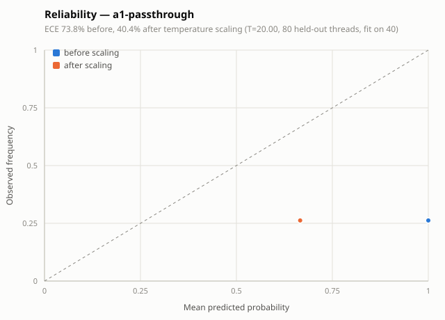
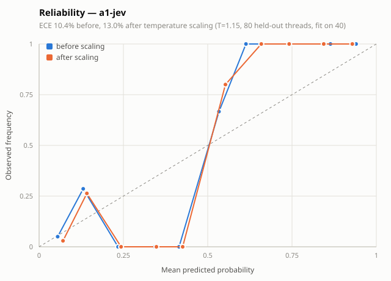
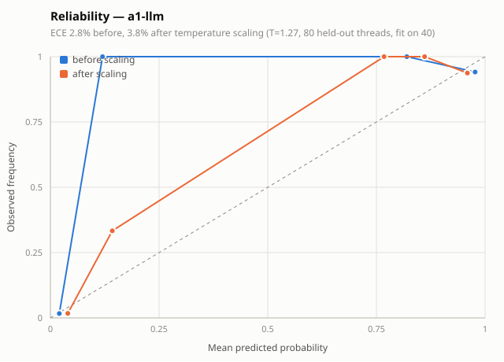
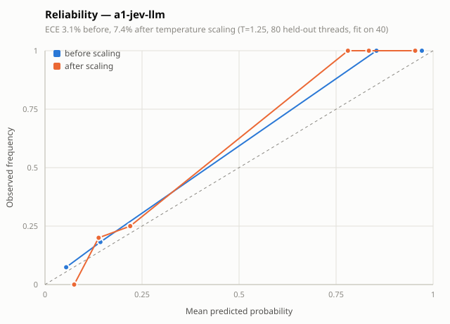

# Results

Written by `digest eval` against `data/gold.json`. Regenerate rather than edit.
Each value is a percentage with the counts behind it. With about 120 threads, gaps of a
few points are noise.

| Metric | Configuration | Value |
| --- | --- | --- |
| Silo recall | core | 100.0% (12 of 12) |
| Silo recall | llm | 100.0% (12 of 12) |
| Silo recall | a1-passthrough | 100.0% (12 of 12) |
| Silo recall | a1-jev | 91.7% (11 of 12) |
| Silo recall | a1-tev | not run: set TOGETHER_API_KEY |
| Silo recall | a1-llm | 100.0% (12 of 12) |
| Silo recall | a1-jev-llm | 91.7% (11 of 12) |
| Silo recall | a2-calibrated | 100.0% (12 of 12) |
| Silo recall | a3-phase | 100.0% (12 of 12) |
| Silo recall | a4-aliases | 100.0% (12 of 12) |
| Digest precision | core | 100.0% (43 of 43) |
| Digest precision | llm | 95.1% (39 of 41) |
| Digest precision | a1-passthrough | 100.0% (43 of 43) |
| Digest precision | a1-jev | 100.0% (31 of 31) |
| Digest precision | a1-tev | not run: set TOGETHER_API_KEY |
| Digest precision | a1-llm | 100.0% (38 of 38) |
| Digest precision | a1-jev-llm | 100.0% (29 of 29) |
| Digest precision | a2-calibrated | 100.0% (43 of 43) |
| Digest precision | a3-phase | 100.0% (43 of 43) |
| Digest precision | a4-aliases | 95.3% (41 of 43) |
| Extractor accuracy | core | 100.0% (120 of 120) |
| Extractor accuracy | llm | 95.0% (114 of 120) |
| Extractor accuracy | a1-passthrough | 100.0% (120 of 120) |
| Extractor accuracy | a1-jev | 91.7% (110 of 120) |
| Extractor accuracy | a1-tev | not run: set TOGETHER_API_KEY |
| Extractor accuracy | a1-llm | 96.7% (116 of 120) |
| Extractor accuracy | a1-jev-llm | 90.0% (108 of 120) |
| Extractor accuracy | a2-calibrated | 100.0% (120 of 120) |
| Extractor accuracy | a3-phase | 100.0% (120 of 120) |
| Extractor accuracy | a4-aliases | 95.8% (115 of 120) |
| Decider accuracy: changes_state | core | not run: no decider |
| Decider accuracy: changes_state | llm | not run: no decider |
| Decider accuracy: changes_state | a1-passthrough | 29.2% (35 of 120) |
| Decider accuracy: changes_state | a1-jev | 88.3% (106 of 120) |
| Decider accuracy: changes_state | a1-tev | not run: set TOGETHER_API_KEY |
| Decider accuracy: changes_state | a1-llm | 95.0% (114 of 120) |
| Decider accuracy: changes_state | a1-jev-llm | 90.0% (108 of 120) |
| Decider accuracy: changes_state | a2-calibrated | not run: no decider |
| Decider accuracy: changes_state | a3-phase | not run: no decider |
| Decider accuracy: changes_state | a4-aliases | not run: no decider |
| Decider accuracy: change_type | core | not run: no decider |
| Decider accuracy: change_type | llm | not run: no decider |
| Decider accuracy: change_type | a1-passthrough | n/a (0 of 0) |
| Decider accuracy: change_type | a1-jev | 42.9% (15 of 35) |
| Decider accuracy: change_type | a1-tev | not run: set TOGETHER_API_KEY |
| Decider accuracy: change_type | a1-llm | 88.6% (31 of 35) |
| Decider accuracy: change_type | a1-jev-llm | 65.7% (23 of 35) |
| Decider accuracy: change_type | a2-calibrated | not run: no decider |
| Decider accuracy: change_type | a3-phase | not run: no decider |
| Decider accuracy: change_type | a4-aliases | not run: no decider |
| Decider accuracy: contradicts | core | not run: no decider |
| Decider accuracy: contradicts | llm | not run: no decider |
| Decider accuracy: contradicts | a1-passthrough | 96.7% (116 of 120) |
| Decider accuracy: contradicts | a1-jev | 89.2% (107 of 120) |
| Decider accuracy: contradicts | a1-tev | not run: set TOGETHER_API_KEY |
| Decider accuracy: contradicts | a1-llm | 76.7% (92 of 120) |
| Decider accuracy: contradicts | a1-jev-llm | 85.8% (103 of 120) |
| Decider accuracy: contradicts | a2-calibrated | not run: no decider |
| Decider accuracy: contradicts | a3-phase | not run: no decider |
| Decider accuracy: contradicts | a4-aliases | not run: no decider |
| Decider accuracy: risk | core | not run: no decider |
| Decider accuracy: risk | llm | not run: no decider |
| Decider accuracy: risk | a1-passthrough | not run: gold has no risk labels |
| Decider accuracy: risk | a1-jev | not run: gold has no risk labels |
| Decider accuracy: risk | a1-tev | not run: set TOGETHER_API_KEY |
| Decider accuracy: risk | a1-llm | not run: gold has no risk labels |
| Decider accuracy: risk | a1-jev-llm | not run: gold has no risk labels |
| Decider accuracy: risk | a2-calibrated | not run: no decider |
| Decider accuracy: risk | a3-phase | not run: no decider |
| Decider accuracy: risk | a4-aliases | not run: no decider |
| Calibration error | core | not run: no decider |
| Calibration error | llm | not run: no decider |
| Calibration error | a1-passthrough | 73.8% before, 40.4% after (T=20.00, fit 40, eval 80) |
| Calibration error | a1-jev | 10.4% before, 13.0% after (T=1.15, fit 40, eval 80) |
| Calibration error | a1-tev | not run: set TOGETHER_API_KEY |
| Calibration error | a1-llm | 2.8% before, 3.8% after (T=1.27, fit 40, eval 80) |
| Calibration error | a1-jev-llm | 3.1% before, 7.4% after (T=1.25, fit 40, eval 80) |
| Calibration error | a2-calibrated | not run: no decider |
| Calibration error | a3-phase | not run: no decider |
| Calibration error | a4-aliases | not run: no decider |
| Escalation rate | core | not run: no decider |
| Escalation rate | llm | not run: no decider |
| Escalation rate | a1-passthrough | 0.0% (0 of 120) |
| Escalation rate | a1-jev | 25.0% (30 of 120) |
| Escalation rate | a1-tev | not run: set TOGETHER_API_KEY |
| Escalation rate | a1-llm | 2.5% (3 of 120) |
| Escalation rate | a1-jev-llm | 24.2% (29 of 120) |
| Escalation rate | a2-calibrated | not run: no decider |
| Escalation rate | a3-phase | not run: no decider |
| Escalation rate | a4-aliases | not run: no decider |
| Decider latency (median) | core | not run: no decider |
| Decider latency (median) | llm | not run: no decider |
| Decider latency (median) | a1-passthrough | 0 ms |
| Decider latency (median) | a1-jev | 174 ms |
| Decider latency (median) | a1-tev | not run: set TOGETHER_API_KEY |
| Decider latency (median) | a1-llm | 3070 ms |
| Decider latency (median) | a1-jev-llm | 184 ms |
| Decider latency (median) | a2-calibrated | not run: no decider |
| Decider latency (median) | a3-phase | not run: no decider |
| Decider latency (median) | a4-aliases | not run: no decider |
| Cost per digest | core | not run: no decider |
| Cost per digest | llm | not run: no decider |
| Cost per digest | a1-passthrough | $0.0000 |
| Cost per digest | a1-jev | $0.0022 |
| Cost per digest | a1-tev | not run: set TOGETHER_API_KEY |
| Cost per digest | a1-llm | $0.0149 |
| Cost per digest | a1-jev-llm | $0.0075 |
| Cost per digest | a2-calibrated | not run: no decider |
| Cost per digest | a3-phase | not run: no decider |
| Cost per digest | a4-aliases | not run: no decider |

## Metrics

- **Silo recall**: Of the (cross-team case, affected person) pairs in gold, the share where the change appears in that person's digest.
- **Digest precision**: Of all items in every person's digest on every day, the share that match a gold delta listing that person as affected.
- **Extractor accuracy**: Of all threads, the share where the extractor returned exactly the gold changes: the same targets, delta types and new values, and nothing for a thread with none. A thread skipped for a malformed response counts as a miss.
- **Decider accuracy: changes_state**: Of decided threads, the share where the decider's changes_state at or above 0.5 matches whether gold has any delta for the thread.
- **Decider accuracy: change_type**: Of decided threads with a gold delta and a change_type answer, the share where the highest-probability type matches a gold delta's type.
- **Decider accuracy: contradicts**: Of decided threads, the share where the decider's contradicts at or above 0.5 matches whether gold marks a delta as contradicting recorded state.
- **Decider accuracy: risk**: Not scorable: gold carries no risk labels, so the risk answer is reported unscored.
- **Calibration error**: Expected calibration error (10 bins) of changes_state against whether gold has a delta for the thread, measured on the two thirds of threads not used for fitting; before and after temperature scaling fit on the fixed seeded third (digest/attach/calibrate.py). Reliability plots sit beside results.md under calibration/.
- **Escalation rate**: Of decided threads, the share with changes_state between 0.2 and 0.8. Without an escalation decider they go to the extractor and are logged; with one, the second opinion settles them, so this is the share paying for the second call.
- **Decider latency (median)**: Median wall-clock time of one decide call across all decided threads.
- **Cost per digest**: Decider spend for the full run divided by digests with at least one item. The replay extractor is free; token prices are the placeholder estimates in digest/attach/deciders.py.

## Configurations

- **core**: Replay extractor (gold deltas), core fan-out, fixed-weight ranker, top five.
- **llm**: LLMExtractor on gpt-6-sol, core fan-out, fixed-weight ranker, top five.
- **a1-passthrough**: A1 baseline: replay extractor behind the cascade with PassThroughDecider, so every thread goes to the extractor.
- **a1-jev**: A1 cascade with JevDecider (TypeSafe jev-latest, all four questions in one call), replay extractor past the gate. Needs JEV_API_KEY.
- **a1-tev**: A1 cascade with TevDecider (Together Tev1, one letter-only call per question; log-probabilities when exposed, else hard 0 or 1), replay extractor past the gate. Needs TOGETHER_API_KEY. Live run cut Oct 4 for simplicity (see SPEC.md); the backend stays implemented and tested on recorded responses.
- **a1-llm**: A1 cascade with LLMDecider (structured output on the model named by DIGEST_DECIDER_MODEL), replay extractor past the gate. Needs DIGEST_DECIDER_MODEL and OPENAI_API_KEY.
- **a1-jev-llm**: A1 two-stage cascade, added after the first eval round (EXPERIMENTS.md): jev gates every thread, the 0.2-0.8 middle band is re-decided by the LLM decider, and that answer is final. Replay extractor past the gate. Needs JEV_API_KEY, DIGEST_DECIDER_MODEL and OPENAI_API_KEY.
- **a2-calibrated**: A2: replay extractor, calibrated ranker. Each section keeps every item whose confidence clears its cost-ratio threshold (10:1 needs-you, 3:1 affects-you, 1:1 FYI) instead of a top-five cut; no decider, so temperature stays 1.0.
- **a3-phase**: A3: replay extractor, stage-aware ranker (--phase). Scores by stage distance to the stages the person owns in the product's active process, raised by proximity to its gate; phase_weights.yaml beside the dataset breaks ties. Top five, like core.
- **a4-aliases**: A4: LLMExtractor plus alias resolution in apply (--aliases); compare against the llm row, since the replay extractor already emits canonical IDs and gives aliases nothing to do. Surface names resolve through the aliases table before a delta is matched; names resolving nowhere land in the unresolved table and are listed below. Needs DIGEST_EXTRACTOR_MODEL and OPENAI_API_KEY.

## Unresolved names

Names `apply` could not match to a task or requirement, even through the aliases
table (A4). Each is fixed once by adding an alias row to the graph seed.

None recorded by any configuration that ran.

## Reliability plots

One per decider backend that ran, written beside this file:

- 
- 
- 
- 
